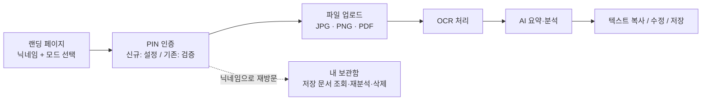

<div align="center">
  

  # PenSight

  **손글씨를 텍스트로, 텍스트를 통찰로.**
  손글씨 문서를 OCR로 텍스트화하고 AI로 요약해주는 교사용 웹 서비스

  [배포 바로가기](https://amazing-axolotl-ee7258.netlify.app) · [GitHub](https://github.com/Ada3verse/pensight)

  
  
  
  
</div>

---

## 목차

1. [서비스 소개](#서비스-소개)
2. [주요 기능](#주요-기능)
3. [기술 스택](#기술-스택)
4. [서비스 구조](#서비스-구조)
5. [보안 설계](#보안-설계)
6. [배포 / 스크린샷](#배포--스크린샷)
7. [로컬 실행 방법](#로컬-실행-방법)

---

## 서비스 소개

**PenSight는 손으로 쓴 문서(상담 기록, 수행평가지 등)를 촬영해 올리면 텍스트로 변환하고, AI가 핵심 내용을 요약해주는 웹 서비스입니다.**

학교 현장에서 교사는 진로 상담 기록, 수행평가 답안, 학교폭력 진술서 등 손글씨 문서를 매일 다루지만, 이를 다시 찾아보거나 핵심만 파악하려면 원문을 처음부터 다시 읽어야 하는 번거로움이 있습니다. PenSight는 이런 문서를 빠르게 디지털화하고 요약해, 교사가 문서 내용을 확인하는 시간을 줄이는 것을 목표로 만들었습니다. 현재는 동신중학교 교사를 대상으로 배포되어 있습니다.

## 주요 기능

| 기능 | 설명 |
|---|---|
| **손글씨/인쇄물 OCR** | Google Cloud Vision API로 JPG, PNG, PDF(다중 페이지 포함) 문서를 텍스트로 변환 |
| **AI 요약·분석** | Claude API로 핵심 요약과 키워드를 추출. AI 분석 모드에서는 문서 유형(진로 상담 / 학교폭력 진술 / 수행평가 / 기타)까지 자동 분류 |
| **세특 자동 생성** | 수행평가 결과물에서 추출된 텍스트와 키워드로 학생별 세부능력 및 특기사항 초안을 생성 (최대 25명 일괄 처리, 자유학기/과목별 모드, 금지어 자동 검사) |
| **닉네임 + PIN 기반 보관함** | 회원가입 없이 닉네임과 4자리 PIN만으로 본인 문서만 조회·관리 |
| **결과 편집·복사** | OCR로 추출된 텍스트를 직접 수정하거나 전체 복사 |
| **문서 저장 및 재분석** | 추출한 텍스트를 저장해두고, 보관함에서 언제든 AI 분석을 다시 실행 |
| **관리자 페이지** (`/#/admin`) | 전체 업로드 현황 통계, 전체 문서 목록 조회, 닉네임별 PIN 초기화 및 삭제 |

## 기술 스택

**Frontend**
- React 19, Vite 8
- 별도 상태관리 라이브러리 없이 컴포넌트 상태로 구현

**데이터/인프라**
- Firebase Firestore (문서·닉네임 데이터 저장). 신규 문서 생성만 클라이언트 SDK로 직접 쓰고, 조회·수정·삭제·관리자 작업은 Netlify Functions에서 firebase-admin SDK로 처리
- Netlify (정적 호스팅, 배포, 서버리스 함수)

**OCR**
- Google Cloud Vision API (`DOCUMENT_TEXT_DETECTION`)
- pdf.js — PDF를 페이지별 이미지로 변환 후 OCR 요청

**AI**
- Anthropic Claude API (`@anthropic-ai/sdk`, `claude-sonnet-4-6`)

## 서비스 구조

**일반 사용자 흐름**



- **빠른 OCR 모드**: 텍스트 추출까지만 진행하고, 필요할 때 버튼을 눌러 AI 분석을 추가로 실행합니다.
- **AI 분석 모드**: OCR이 끝나면 AI 요약이 자동으로 이어서 실행됩니다.

**관리자 흐름**

`/#/admin` 경로로 접속 → 관리자 전용 PIN 인증 → 전체 통계 확인, 문서 열람, 닉네임별 PIN 초기화/삭제

## 보안 설계

- **PIN 인증**: 닉네임마다 4자리 PIN을 설정합니다. PIN은 평문으로 저장하지 않고 SHA-256으로 해시하여 Firestore에 저장하며, 해시 계산·비교는 Netlify Function(`auth.js`)에서 서버 측으로 처리합니다. 5회 연속 오류 시 잠기며, 이후에는 관리자 페이지에서 PIN을 초기화해야 재사용할 수 있습니다. 관리자 페이지 자체도 별도의 관리자 PIN으로 보호되며, 인증 성공 시 서버가 서명·만료시간이 있는 토큰을 발급해 이후 관리자 API 호출에 사용합니다.
- **익명화**: 이름, 이메일 등 개인 식별 정보를 요구하지 않고 닉네임만으로 서비스를 이용합니다. 별도 회원가입 절차가 없으며, 문서 조회 역시 입력한 닉네임 기준으로만 필터링됩니다.
- **Firestore 보안 규칙**(`firestore.rules`): Firebase Auth를 사용하지 않는 구조라 규칙만으로는 "쿼리 결과를 닉네임별로 제한"할 수 없습니다(Firestore는 list 요청을 문서 단위가 아니라 요청 전체로 허용/차단합니다). 그래서 클라이언트가 Firestore에 직접 하는 접근은 `documents` 컬렉션의 신규 생성만 허용하고, 나머지 조회·수정·삭제·관리자 작업은 전부 규칙에서 차단한 뒤 Netlify Functions(`auth.js`, `documents.js`, `admin-data.js`)가 firebase-admin SDK로 닉네임 일치 여부를 검증하고 나서만 처리합니다.
- **마스킹 안내**: 업로드 화면에 "업로드 전 민감 정보를 직접 가려달라"는 안내 문구를 표시해, 사용자가 개인정보가 포함된 부분을 인지하고 업로드하도록 유도합니다. 이미지·텍스트에서 개인정보를 자동으로 탐지해 가리는 기능은 아직 구현되어 있지 않습니다.

## 배포 / 스크린샷

- **배포 URL**: https://amazing-axolotl-ee7258.netlify.app
- 실제 화면은 위 링크에서 확인할 수 있습니다. 랜딩 → PIN 인증 → 업로드 → 결과 → 보관함 순서로 살펴보는 것을 권장합니다.
- 스크린샷을 저장소에 포함하려면 `docs/screenshots/` 폴더를 만들어 이미지를 추가하고, 이 섹션에 아래와 같이 링크를 연결해주세요.

  ```markdown
  
  
  
  
  ```

## 로컬 실행 방법

**사전 준비물**
- Node.js 20 이상
- Firebase 프로젝트 (Firestore 사용 설정)
- Firebase 서비스 계정 키 (Firebase 콘솔 → 프로젝트 설정 → 서비스 계정 → 새 비공개 키 생성 → Netlify Functions에서 Admin SDK로 사용)
- Google Cloud Vision API 키
- Anthropic API 키

**설치 및 실행**

```bash
git clone https://github.com/Ada3verse/pensight.git
cd pensight
npm install
```

`.env.example`을 복사해 `.env` 파일을 만들고 아래 값을 채워주세요.

```env
VITE_FIREBASE_API_KEY=
VITE_FIREBASE_AUTH_DOMAIN=
VITE_FIREBASE_PROJECT_ID=
VITE_FIREBASE_STORAGE_BUCKET=
VITE_FIREBASE_MESSAGING_SENDER_ID=
VITE_FIREBASE_APP_ID=
ANTHROPIC_API_KEY=
GOOGLE_CLOUD_API_KEY=
ADMIN_PIN=
FIREBASE_SERVICE_ACCOUNT_KEY=
DEV_MOCK=true
```

`ANTHROPIC_API_KEY`, `GOOGLE_CLOUD_API_KEY`, `ADMIN_PIN`, `FIREBASE_SERVICE_ACCOUNT_KEY`는 Netlify Functions에서만 쓰는 서버 전용 값이라 `VITE_` 접두사를 붙이면 안 됩니다(붙이면 빌드 시 클라이언트 번들에 그대로 노출됩니다). `ADMIN_PIN`에는 평문 PIN이 아니라 그 PIN의 SHA-256 해시값을 등록해야 합니다(일반 사용자 PIN과 동일한 해시 방식). 해시값은 아래 명령으로 로컬에서 생성할 수 있습니다.

```bash
node -e "console.log(require('crypto').createHash('sha256').update('입력할PIN').digest('hex'))"
```

`FIREBASE_SERVICE_ACCOUNT_KEY`에는 서비스 계정 JSON 파일 내용을 한 줄 문자열로 그대로 넣으면 됩니다.

**Firestore 보안 규칙 배포**

저장소 루트의 `firestore.rules` 내용을 Firebase 콘솔 → Firestore Database → 규칙 탭에 붙여넣고 게시하세요. (Firebase CLI를 쓰는 경우 `firebase deploy --only firestore:rules`.) 이 규칙이 배포되어 있지 않으면 콘솔의 기존 규칙(`if true` 등)이 그대로 적용되어 위에서 설명한 서버 측 검증이 무의미해집니다.

```bash
npm run dev       # 개발 서버 실행
npm run build      # 프로덕션 빌드
npm run preview    # 빌드 결과 미리보기
```

**`DEV_MOCK` 환경변수**

세특 자동 생성 함수(`netlify/functions/sespec.js`)는 `DEV_MOCK=true`이거나 `NODE_ENV=development`일 때 Claude API를 호출하지 않고 Mock 데이터를 반환하며, 콘솔에 `[MOCK MODE]` 로그를 남깁니다. 로컬 개발 시에는 `DEV_MOCK=true`를 유지해 API 비용 없이 테스트하고, Netlify 배포 환경(Site settings → Environment variables)에는 **반드시 `DEV_MOCK=false`로 설정**해 실제 Claude API가 호출되도록 해야 합니다. (Netlify는 함수 실행 시 `NODE_ENV=production`을 자동으로 설정하므로 `DEV_MOCK`을 빠뜨려도 Mock으로 빠지진 않지만, 값을 명시적으로 `false`로 두는 편이 안전합니다.)

이 Mock 배너(`SespecGeneratorForm.jsx`의 "⚠️ 현재 Mock 모드입니다" 문구)는 Vite의 `import.meta.env.DEV`를 기준으로 표시되며, `npm run build`로 만든 프로덕션 번들에서는 코드 자체가 제거되어 배포 환경 변수 설정과 무관하게 절대 노출되지 않습니다.

**배포 전 체크리스트 (Netlify 대시보드에서 수동 설정 필요)**

Site settings → Environment variables에 아래 값이 모두 등록되어 있는지 확인하세요.

| 변수 | 값 | 비고 |
|---|---|---|
| `DEV_MOCK` | `false` | 세특 생성이 실제 Claude API를 호출하도록 함 |
| `ANTHROPIC_API_KEY` | 실제 Anthropic API 키 | AI 분석·마스킹·세특 생성 함수가 공용으로 사용 |
| `GOOGLE_CLOUD_API_KEY` | 실제 Google Cloud Vision API 키 | OCR 함수(`ocr.js`)가 사용 |
| `ADMIN_PIN` | 관리자 PIN의 SHA-256 해시값 | 평문 PIN을 넣지 말 것 |
| `FIREBASE_SERVICE_ACCOUNT_KEY` | Firebase 서비스 계정 JSON 전체 | `auth.js`/`documents.js`/`admin-data.js`가 사용 |
| `VITE_FIREBASE_*` (6종) | Firebase 프로젝트 설정값 | 클라이언트 SDK 초기화용 |

그리고 Firebase 콘솔에서 `firestore.rules`가 실제로 게시되어 있는지도 배포 전에 다시 확인하세요.
